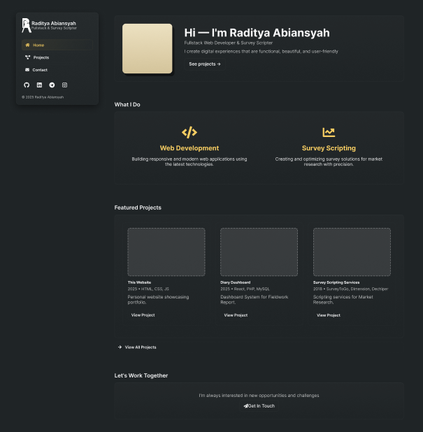

# radityaabi.com

The personal website of Raditya Abiansyah.

Access it here :

- [https://radityaabi.com](https://radityaabi.com)

UI design on Figma:

- <https://www.figma.com/design/7rccUbkkxOEOCCrygRwBf6/radityaabi.com>

The goal is to be simple, clean and easy navigate. It showcases my skills, projects and contact.

Pages :

- Home
- Projects
- Contact

# Inspirations

- [Britanny Chiang](https://brittanychiang.com/)
- [Henhen Muldani](https://henhenmuldani.com/)

# Home

Skills :

- Javascript
- Python
- PHP
- Node.js
- Markdown
- VS Code / Cursor
- Git
- Github
- HTML
- CSS
- MySQL
- SurveyToGo
- Dechiper
- UNICOM Dimension

# Projects

Details for the entire projects with Filter Feature.

# Contact

Social Media:

- [LinkedIn](https://www.linkedin.com/in/radityaabi/)
- [GitHub](https://github.com/radityaabi)
- [Telegram](https://t.me/radityaabi)
- [Instagram](https://instagram.com/radityaabi08)

# Screenshoots

